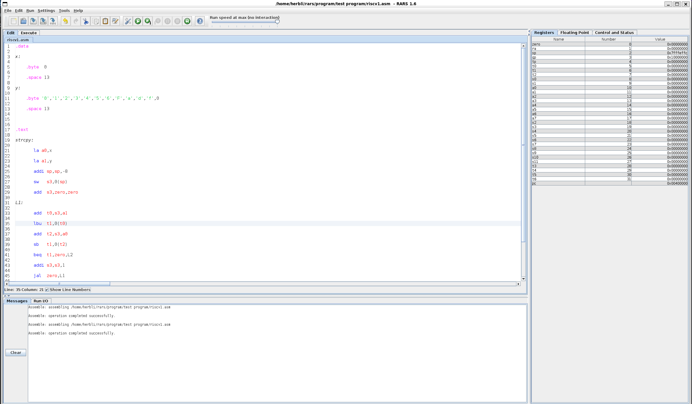
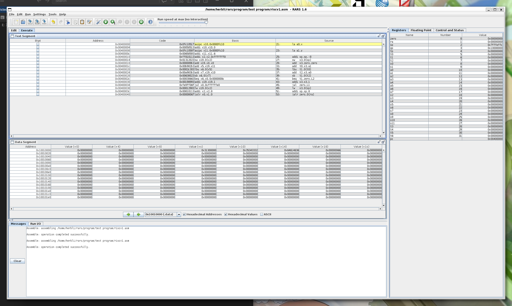
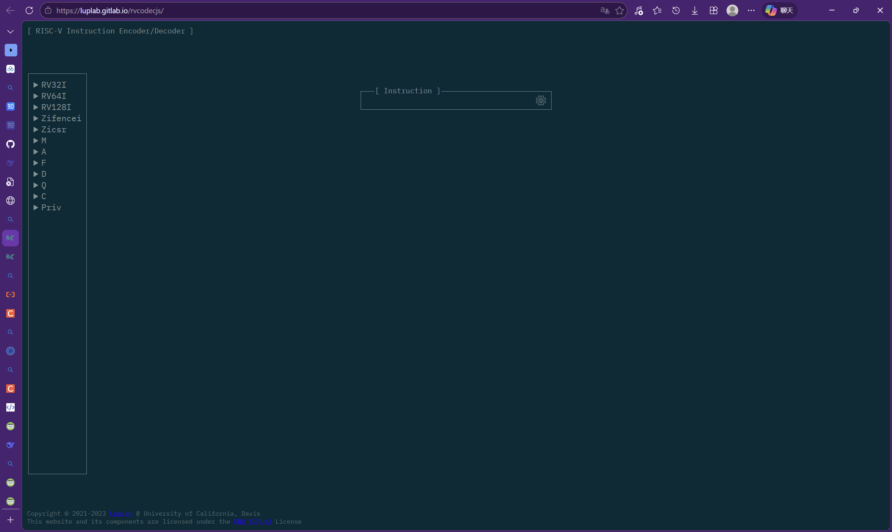

# 1. RARS  

RARS是一款轻量化riscv环境，可以执行riscv汇编程序，并观察各个变量和寄存器的取值  
github下载地址：  
https://github.com/TheThirdOne/rars/releases/tag/v1.6  

我用的wsl，所以通过命令行进行安装，需要安装：  
WSL可视化环境、WSL的java环境、RARS软件  

```bash
sudo apt update 
sudo apt upgrade 

# 安装java环境
sudp apt install default-jdk -y 
# 测试java环境，若出现java版本号则安装成功
java -version

# 安装可视化环境
sudo apt isntall x11-apps -y
# 测试可视化环境，若出现一个有眼睛的窗口则安装成功
xeyes 

# 创建rars安装文件夹
mkdir ~/rars && cd ~/rars 
# 安装rars
wget https://github.com/TheThirdOne/rars/releases/download/v1.6/rars1_6.jar 
# 启动rars
java -jar rars1_6.jar 

# 启动rars窗口（windows形制）

```

  
  

# 2. LUPLAB

luplab是一个riscv反汇编网站，可以把riscv汇编指令转化为对应的二进制/十六进制机器码，便于riscv芯片LUT模块的设计  
网址：  
https://luplab.gitlab.io/rvcodecjs/  

 
